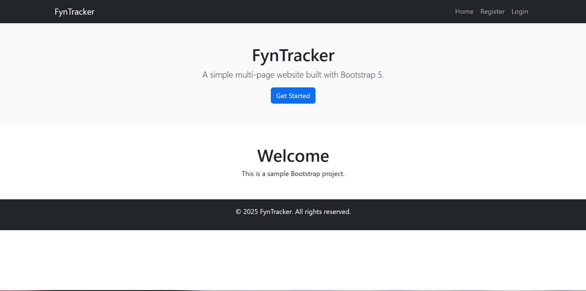
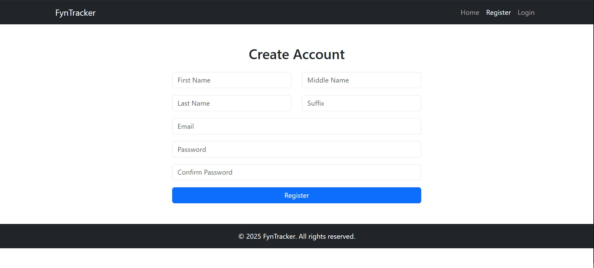
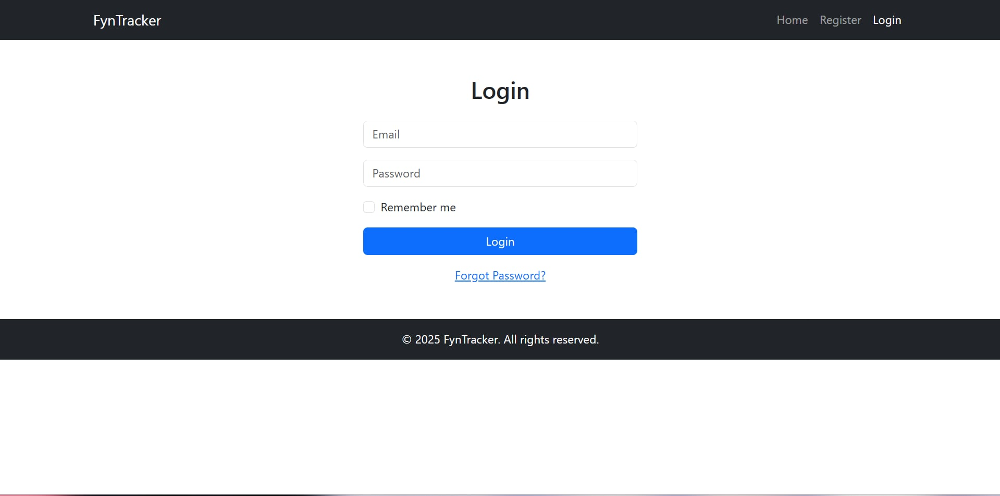
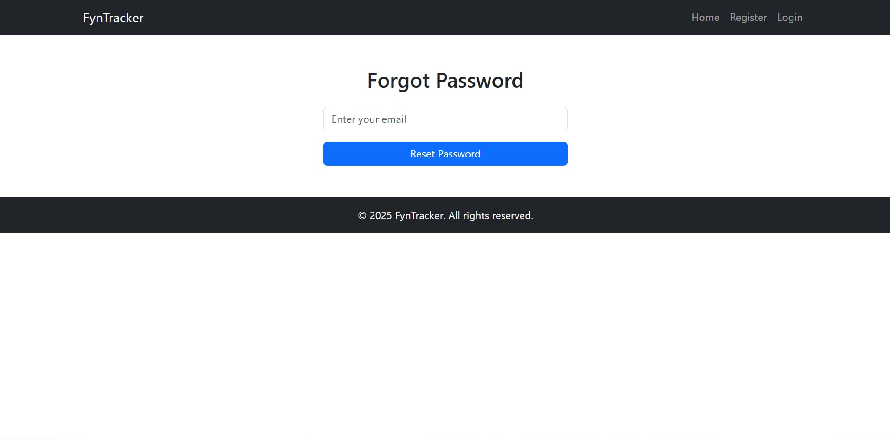

# Bootstrap Multi-Page Website

A simple multi-page website built with Bootstrap 5. Includes homepage, registration, login, and forgot password pages with a consistent navbar and footer.

## 👨‍👩‍👧‍👦 Group Members
- Lander Escobio
- Andrei Aiane E. Guinocor
- Van Zymmer Monilar
- Maniell Ivan Gacasan

## 📷 Screenshots

## 🌍 Live Demo
[GitHub Pages Demo](https://AndreiGuinocor.github.io/fyntracker/)
